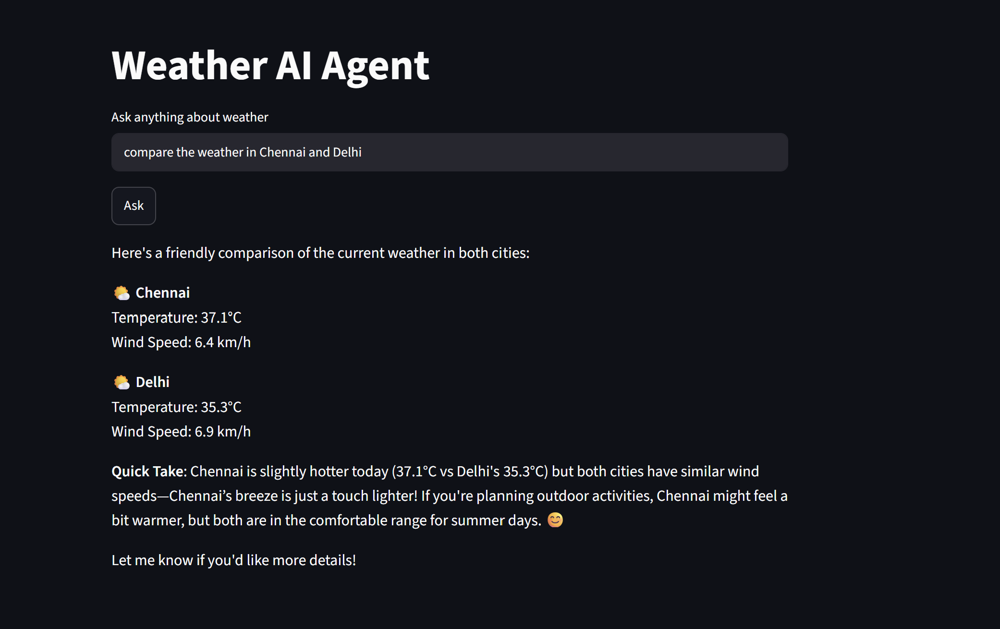
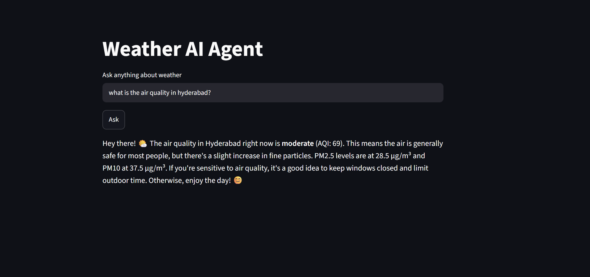

# Weather AI Agent

I was really excited to build this project because until now we have mostly seen LLMs that answer our questions. But agents take things one step further. Instead of only answering questions, they can perform tasks, use tools, collect information from external sources, and then update us with the results.

To understand how an agent works, I chose a simple Weather and Air Quality project.

In this project, the agent can get live weather information and air quality details for any city mentioned by the user.

## Flowchart
```
User Question
      ↓
     Agent
      ↓
Tool Selection
   ↙      ↘
Weather   Air Quality
        ↓
     Answer
```

## Project Overview

The system contains two main tools:

### 1. Weather Tool

The Weather Tool takes a city name from the user.

* It first gets the geographical coordinates (latitude and longitude) using a helper function.
* It then calls the Open-Meteo Weather API.
* Finally, it returns the current weather information for that city.

### 2. Air Quality Tool

The Air Quality Tool also takes a city name.

* It uses the same helper function to get geographical coordinates.
* It calls the Open-Meteo Air Quality API.
* It returns the air quality information for the requested city.

### Agent Setup

An agent is created using:

* LangChain
* Ollama
* Qwen Model
* Available Tools
* System Prompt

The agent has access to both the Weather Tool and Air Quality Tool.

When the user enters a question through the Streamlit interface, the agent is invoked and decides how to answer the request.


### What Happens When agent.invoke() Runs?

One thing I found interesting is that the `agent.invoke()` function automatically handles many tasks that we would otherwise have to implement manually.

Internally, the agent performs the following steps:

### **LLM Reasoning**

* Understand the user's question.
* Decide what action should be taken.

### **Tool Selection**

* Choose the most appropriate tool.

### **Argument Extraction**

* Extract the required input for the selected tool.
* Example:

  * Warangal
  * Hyderabad
  * Delhi

### **Tool Execution**

* Call the selected Python function.
* Pass the extracted arguments.

### **Tool Result Handling**

* Receive the result from the tool.

### **Final Answer Generation**

* Convert the tool output into a user-friendly response.

This entire process is handled automatically by the LangChain framework.

## How to Run the Project

### Step 1: Install Ollama

Download and install Ollama from:

https://ollama.com

### Step 2: Download the (LLM)Model

Open a terminal and run:

```bash
ollama pull qwen3:4b
```

### Step 3: Start Ollama

Since we choose the LLM model to be locally without API call, make sure Ollama is running in the background

You can verify the model is available:

```bash
ollama list
```

### Step 4: Install Project Dependencies

Navigate to the project folder:

```bash
cd weather-air-quality-agent
```

Install dependencies:

```bash
pip install -r requirements.txt
```

### Step 5: Run the Streamlit Application

```bash
streamlit run app.py
```

### Step 6: Open the Application

Streamlit will display a local URL similar to:

```text
http://localhost:8501
```
Open the URL in your browser.

### Step 7: Ask Questions

Example queries:

# Sample Outputs

### Weather Information



### Air Quality Information




## Learning Outcome

This project helped me understand how modern AI agents work.

I learned:

* Tool Creation
* Tool Routing
* Agent Reasoning
* Tool Selection
* API Integration
* LangChain Agents
* Ollama Integration
* Streamlit UI Development

Most importantly, I understood how a single `agent.invoke()` call can orchestrate the complete agent workflow behind the scenes.

This project uses a simple weather use case, but the same concepts can later be extended to research agents, RAG systems, multi-tool assistants, and multi-agent architectures.
